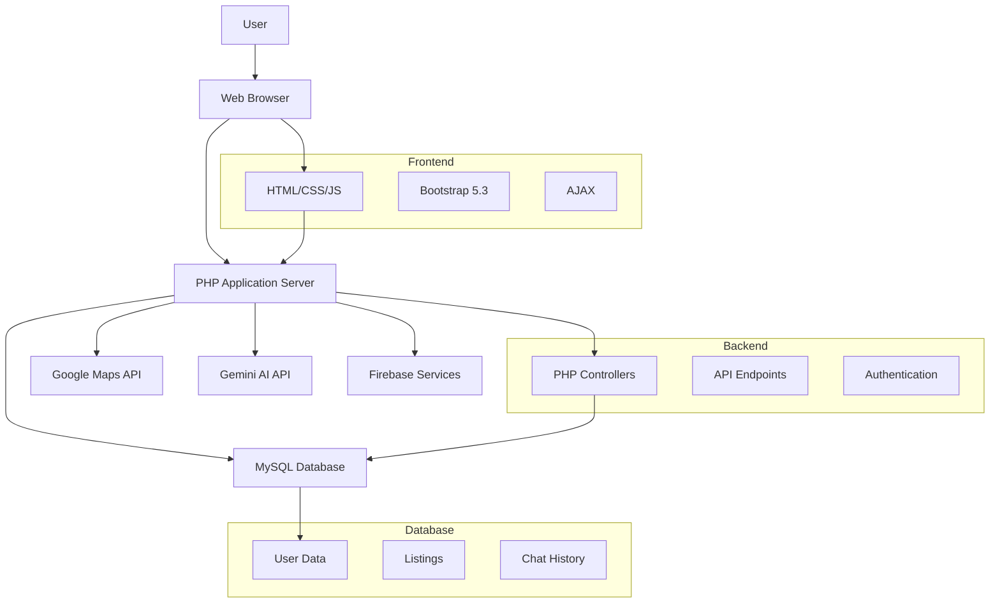

# 🏠 NearBy – Student Housing & Local Services Platform

**NearBy** is a student-centric web platform built to simplify the process of finding **rental rooms, PGs, hostels, and essential local services** in a new city.  
The platform eliminates broker dependency and connects **students, property owners, and local service providers** directly in a trusted, user-friendly environment.


[](https://example.com)
[](https://github.com/sumitrathor1/nearby/stargazers)
[](https://github.com/sumitrathor1/nearby/network/members)
[](https://github.com/sumitrathor1/nearby/issues)
[](https://github.com/sumitrathor1/nearby/blob/main/LICENSE)
[](https://php.net)
[](https://mysql.com)


## �️ Architecture Diagram



---

## �🌟 Problem Statement

When students move to a new city for education, they often face challenges such as:

- Difficulty finding safe and affordable accommodation
- High brokerage charges
- Unreliable listings and lack of trust
- No single platform for daily local services (food, milk, gas, etc.)
- Feeling lost without local guidance

## ✅ Solution – NearBy

**NearBy** solves these problems by providing:

- Verified accommodation listings near campuses
- Direct communication with owners and service providers
- Local guidance for food, transport, and daily needs
- AI-powered chatbot support
- A modern, clean, and mobile-friendly interface

The platform is designed **by students, for students**, keeping real-life needs in mind.

---

## ✨ Features

### 🏡 Accommodation Discovery
- Browse **PGs, rooms, flats, and hostels**
- Student-focused listings near campuses
- **Advanced filters** available:
  - 📍 Location
  - 💰 Rent range
  - 🏠 Accommodation type
  - 👥 Gender preference *(Male / Female / Family)*
  - 🛠️ Facilities *(Wi-Fi, Food, Parking, Water, Electricity, CCTV, Power Backup)*

---

### 🧑‍🤝‍🧑 Multi-Role User System
Supports multiple user roles:

- 🎓 **Students**
- 🏠 **Property Owners**
- 🛠️ **Local Service Providers**

Features include:
- Dedicated dashboards for each role
- Role-based access and functionality

---

### 🏠 Property & Listing Management
**Property owners can:**
- ➕ Add new accommodation listings
- ✏️ Edit and manage their listings

**Service providers can:**
- ➕ Add and manage local service listings

📡 Listings update **in real time** for users.

---

### 🧺 Local Services Directory
Discover essential local services such as:

- 🍱 Tiffin / Mess services
- 🥛 Milk (Doodh) providers
- 🔥 Gas suppliers
- 🥬 Vegetable (Sabji) vendors
- 🛒 Other daily-need services

Everything accessible **from one platform**.

---

### 🤖 AI-Powered Chatbot Assistance
Integrated **AI chatbot powered by Gemini AI**.

Available on:
- 🏠 Home page
- 🔎 Search page
- 📊 User dashboards

Capabilities:
- Accommodation and service guidance
- Local help and suggestions
- Student-friendly Q&A

Additional features:
- 🔐 Login-based access control
- 💾 Secure chat history storage
- 🌐 Works on both local and live servers

---

### 📍 Local Guidance & Discovery
Helps students find:

- 🍽️ Nearby food options
- 🚌 Transport information
- 🏥 Hospitals and essential shops

Acts as a **digital local guide for new students**.

---

### 🔐 Authentication & Security
- Secure login and authentication system
- Role-based access control

**Guest users can:**
- 👀 View listings
- 🤖 View chatbot interface *(login required to interact)*

Includes clean session and backend handling.

---

### 📱 Responsive & Modern UI
- Fully responsive across **all devices**
- Clean, modern, and **student-friendly design**
- ✨ Glassmorphism UI with a **light green theme**

---

### 🌐 Map & Location Integration
- 📍 Location-based discovery of rooms and services
- 🗺️ Map API integration for easier navigation

---

### ⚡ Performance & Usability
- 🚀 AJAX-based interactions for faster performance
- Smooth and intuitive user experience
- Minimal and easy-to-navigate interface


## 🌐 Live Project

🔗 **Website:** [https://sumitrathor.rf.gd/nearby/](https://sumitrathor.rf.gd/nearby/)  
🔗 **GitHub Repository:** [https://github.com/sumitrathor1/nearby](https://github.com/sumitrathor1/nearby)

---

## 🌐 Flow Diagram


---

## 🧩 Core Features

### 🏡 Accommodation Search

- PG, Flat, Room, Hostel listings
- Advanced filters:
  - Location
  - Rent range
  - Accommodation type
  - Allowed for (Male / Female / Family)
  - Facilities (Wi-Fi, Food, Parking, Water, Electricity, CCTV, Power Backup)

### 🧑‍🤝‍🧑 Multi-Role User System

Users on NearBy can be:

- **Students** (Juniors and Seniors)
- **Home / Room Owners**
- **Local Service Providers**:
  - Tiffin / Mess services
  - Milk (Doodh) providers
  - Gas suppliers
  - Vegetable (Sabji) vendors
  - Other daily-need services

Each role can create and manage their own listings.

### 🤖 AI Chatbot Assistance

- Available on:
  - Home Page
  - Search Page
  - Junior & Senior Dashboards
- Login-based access control
- Features:
  - Room and service guidance
  - Local help suggestions
  - Student-friendly Q&A
- Chat history stored securely
- Works seamlessly on **local and live servers**

### 📍 Local Guidance

- Nearby food options
- Transport information
- Hospitals, shops, and essential services
- Helps new students settle quickly and confidently

### 🔐 Authentication & Security

- Secure login system
- Role-based access
- Guest users can view chatbot but must login to use it
- Clean session and backend handling

---

## 📸 Screenshots

### Home Page


### Listings Page


### Local Services


---

## 🛠️ Tech Stack

### Frontend
- **HTML5** - Semantic markup
- **CSS3** - Custom styling with Glassmorphism UI
- **Bootstrap 5.3** - Responsive framework
- **JavaScript (ES6)** - Interactive functionality

### Backend
- **PHP** - Server-side logic
- **MySQL (MySQLi)** - Database management
- **AJAX** - Asynchronous data loading

### Integrations
- **Google APIs** - Maps and authentication
- **Gemini AI** - Chatbot functionality
- **Firebase** - Additional services

---
## 📂 Project Folder Structure
```bash
nearby/
│
├── 🐙 .github/                 # GitHub workflows, CI/CD, and repository configuration
├── 🛠️ admin/                   # Admin dashboard and management tools
├── 🔌 api/                     # API endpoints (AJAX handlers, data fetching logic)
├── 🎨 assets/                  # Static resources (CSS styles, JavaScript, images)
├── ⚙️ config/                  # Application configuration settings
├── 🧠 controllers/             # Business logic and request processing
├── 🗄️ database/                # Database connection, queries, and schema files
├── 📚 docs/                    # Additional project documentation
├── 🧩 includes/                # Reusable UI components (header, footer, modals)
├── 🔒 private/                 # Internal application files (restricted access)
│
├── 🏠 index.php                # Homepage / landing page
├── 🔎 search.php               # Accommodation search interface
├── 📄 details.php              # Detailed listing view
├── 🔐 login.php                # User login page
├── 📝 register.php             # User registration page
├── 📊 junior-dashboard.php     # Dashboard for junior users
├── 🧑‍💼 senior-dashboard.php   # Dashboard for senior users
├── 🛒 second-hand-products.php # Marketplace for second-hand products
├── 💬 feedback.php             # User feedback form
├── 📞 contact.php              # Contact page for support
├── ❓ faq.php                  # Frequently Asked Questions
├── 🔏 privacy.php              # Privacy policy page
├── 📜 terms.php                # Terms of use
│
└── 📘 README.md                # Project documentation and setup guide
```

## 🚀 Future Enhancements

- [ ] Admin verification for listings
- [ ] Rating & review system
- [ ] Second-hand products marketplace
- [ ] Push notifications
- [ ] Mobile app version
- [ ] Advanced AI recommendations
- [ ] Dark/Light mode toggle

---

## 💡 Key Benefits

✅ No brokerage fees  
✅ Student-friendly platform  
✅ Trusted & direct connections  
✅ AI-powered assistance  
✅ Local services in one place  
✅ Fully responsive design  
✅ Easy to scale and extend  

---

## 👥 Contributors

We appreciate all contributors who have helped make NearBy better!

| Name | GitHub | LinkedIn | Role |
|------|--------|----------|------|
| Sumit Rathor | [@sumitrathor1](https://github.com/sumitrathor1) | [LinkedIn](https://linkedin.com/in/sumitrathor) | Project Lead & Developer |
| Rana Pooja | [@RANAPOOJA321](https://github.com/RANAPOOJA321) | [LinkedIn](https://linkedin.com/in/ranapooja) | UI/UX Designer & Contributor |
| [Your Name] | [@yourusername](https://github.com/yourusername) | [LinkedIn](https://linkedin.com/in/yourprofile) | Contributor |

*Want to contribute? See our [Contributing Guidelines](CONTRIBUTING.md) and join the team!*

---

## 📄 License

This project is currently under **development and learning phase**.  
Licensing and commercial usage terms will be defined in future releases.

---

## 🙌 Acknowledgements

Thanks to:

- **Open-source community** for the amazing tools and libraries
- **Student testers and feedback providers** for valuable insights
- **Mentors and peers** who contributed ideas and reviews
- **Elite Coders** program for the opportunity to collaborate

---

**NearBy** – *Helping students find a place and feel at home.* 🌟

## Live Demo Status

The live demo hosted at:

https://sumitrathor.rf.gd/nearby/

may currently return a **502 Bad Gateway** error or **connection timeout** due to hosting server limitations.

The project itself works correctly when run locally.

### Running the Project Locally

1. Install **XAMPP**
2. Clone the repository
3. Move the project folder into the `htdocs` directory
4. Start **Apache** and **MySQL** from the XAMPP Control Panel
5. Open the following URL in your browser:
```bash
http://localhost/nearby/
```
Running the project locally allows contributors to test features even if the live demo is temporarily unavailable.